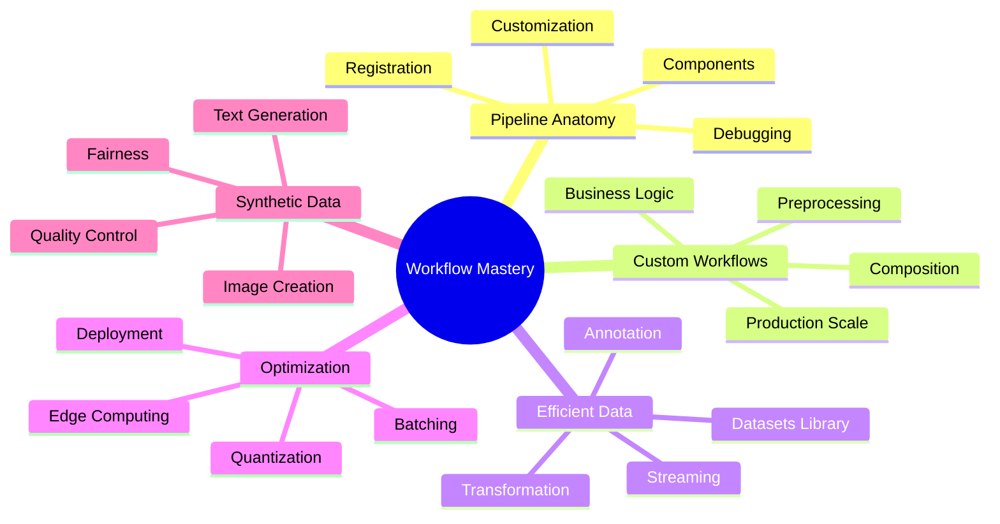
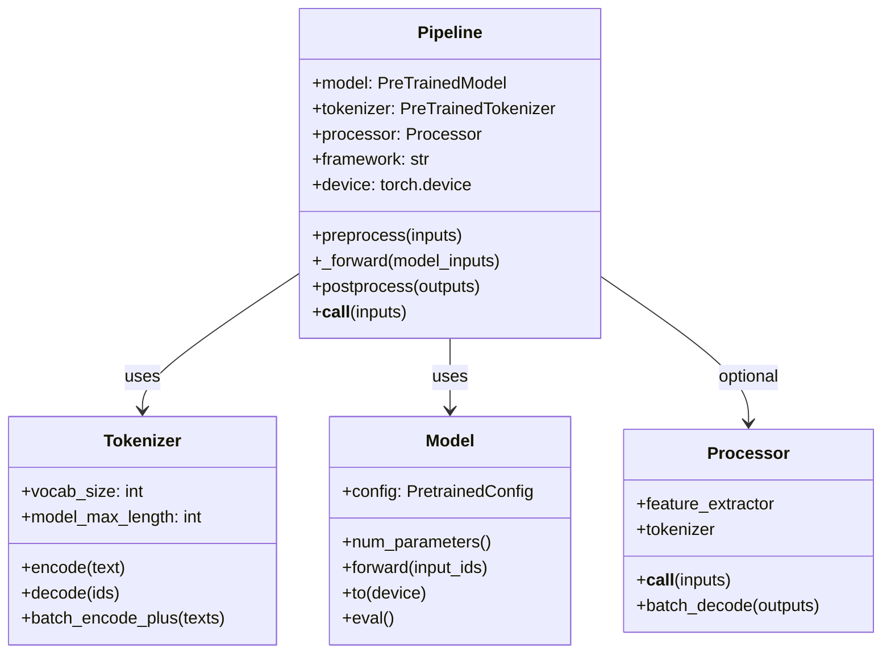
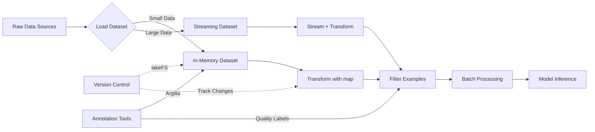
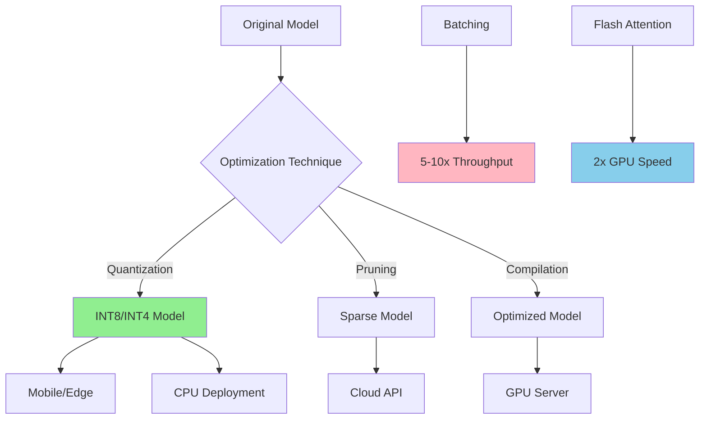
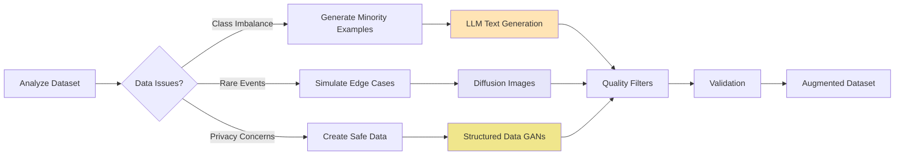
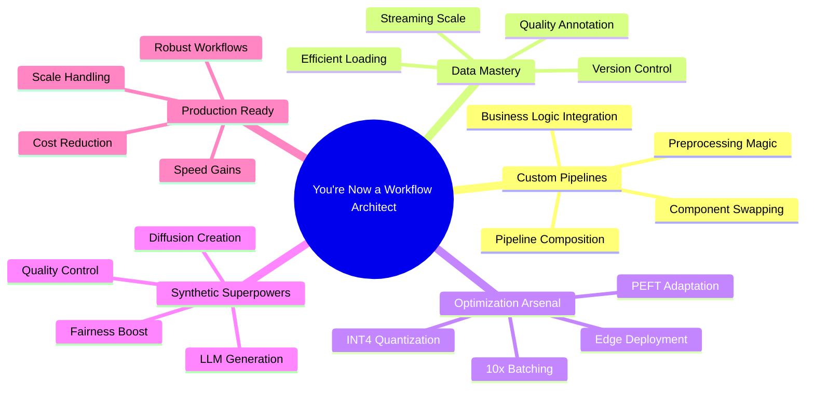

# Customizing Pipelines and Data Workflows: Advanced Models and Efficient Processing



**Step-by-Step Explanation:**
- Root node focuses on **Workflow Mastery** - transforming from user to architect
- Branch covers **Pipeline Anatomy** including components, customization, debugging
- Branch explores **Custom Workflows** with preprocessing, composition, business logic
- Branch details **Efficient Data** handling with Datasets library and streaming
- Branch shows **Optimization** techniques from batching to edge deployment
- Branch presents **Synthetic Data** generation for augmentation and fairness

## Environment Setup

Before diving into custom pipelines, let's set up a proper development environment:

### Poetry Setup (Recommended for Projects)
```bash
# Install poetry if not already installed
curl -sSL https://install.python-poetry.org | python3 -

# Create new project
poetry new huggingface-workflows
cd huggingface-workflows

# Add dependencies with flexible versioning
poetry add "transformers>=4.40.0,<5.0.0" torch torchvision torchaudio
poetry add "datasets>=2.14.0" diffusers accelerate sentencepiece
poetry add pillow soundfile bitsandbytes
poetry add --group dev jupyter ipykernel matplotlib

# Activate environment
poetry shell
```

### Mini-conda Setup (Alternative)
```bash
# Download and install mini-conda from https://docs.conda.io/en/latest/miniconda.html

# Create environment with Python 3.12.9
conda create -n huggingface-workflows python=3.12.9
conda activate huggingface-workflows

# Install packages
conda install -c pytorch -c huggingface transformers torch torchvision torchaudio
conda install -c conda-forge datasets diffusers accelerate pillow soundfile matplotlib
pip install sentencepiece bitsandbytes
```

### Traditional pip with pyenv
```bash
# Install pyenv (macOS/Linux)
curl https://pyenv.run | bash
# Configure shell (add to ~/.bashrc or ~/.zshrc)
export PATH="$HOME/.pyenv/bin:$PATH"
eval "$(pyenv init -)"

# Install Python 3.12.9 with pyenv
pyenv install 3.12.9
pyenv local 3.12.9

# Create virtual environment
python -m venv venv
source venv/bin/activate  # On Windows: venv\Scripts\activate

# Install packages with flexible versioning
pip install "transformers>=4.40.0,<5.0.0" torch torchvision torchaudio
pip install "datasets>=2.14.0" diffusers accelerate sentencepiece
pip install pillow soundfile bitsandbytes jupyter matplotlib
```

## Introduction: From Magic Pipelines to Master Chef—Why Custom Data Workflows Matter

Imagine Hugging Face pipelines as meal kits: quick, convenient, and perfect for a fast start. **Drop in. Run. Done.** But what happens when your customers have allergies? When the recipe doesn't scale to a hundred guests? When you need that secret sauce only you know how to make?

This chapter transforms you from pipeline user to workflow architect. You'll learn how to peek inside Hugging Face pipelines, swap components, and design data workflows that handle scale, complexity, and real business needs.

Let's see just how easy pipelines make things—and where their limits begin.

### Quick Start: Hugging Face Pipeline (2025 Best Practice)

```python
# Modern quick-start with explicit model and device
from transformers import pipeline

# Specify model checkpoint and device for reproducibility
clf = pipeline(
    'sentiment-analysis',
    model='distilbert-base-uncased-finetuned-sst-2-english',
    device=0  # 0 for CUDA GPU, -1 for CPU, 'mps' for Apple Silicon
)

# Run prediction on text
result = clf('I love Hugging Face!')
print(result)
# Output: [{'label': 'POSITIVE', 'score': 0.9998}]

# Check model card: https://huggingface.co/distilbert-base-uncased-finetuned-sst-2-english
```

**Magic!** This single command downloads a pre-trained model, loads the tokenizer, and formats your data. Instant results—no deep setup required. By specifying model and device, you ensure reproducibility.

But out-of-the-box pipelines crumble when you need:
- Custom data cleaning (HTML, emojis, multilingual text)
- Chained models (sentiment + entity recognition)  
- Speed optimization (batching, device placement)
- Business logic (filtering, compliance checks)
- Scale (streaming, batch processing)

Ever felt like a chef stuck with meal kits when you need to cater a wedding?

Here's a real scenario: Your retail chain processes customer reviews from multiple platforms. Standard pipelines work for demos but fail when you need to:
- Clean data from Twitter, Amazon, and internal systems
- Add product metadata
- Process 10,000 reviews per minute
- Log for compliance
- Stream from S3 buckets

**Without custom workflows? Bottlenecks. Errors. Missed SLAs.**

### Custom Preprocessing Before Inference

```python
def custom_preprocess(text):
    # Normalize text for consistent predictions
    import string
    text = text.lower()
    return text.translate(str.maketrans('', '', string.punctuation))

texts = ["Wow! Amazing product!!!", "I don't like this..."]

# Clean then predict
cleaned = [custom_preprocess(t) for t in texts]
results = clf(cleaned, batch_size=16)  # Batch for speed!
print(results)
```

**Step-by-step:**
1. Define preprocessing (lowercase, strip punctuation)
2. Clean inputs before pipeline
3. Use `batch_size` for 5x faster inference
4. Get reliable predictions on normalized data

For production, embed preprocessing directly:

### Advanced: Pipeline Subclassing

```python
from transformers import Pipeline

class CustomSentimentPipeline(Pipeline):
    def preprocess(self, inputs):
        # Strip HTML, normalize text
        text = inputs.lower()
        import string
        text = text.translate(str.maketrans('', '', string.punctuation))
        return super().preprocess(text)
    
    def postprocess(self, outputs):
        # Add confidence thresholds
        results = super().postprocess(outputs)
        for r in results:
            r['confident'] = r['score'] > 0.95
        return results
```

### Streaming Large-Scale Data

```python
from datasets import load_dataset

# Stream massive datasets without memory issues
dataset = load_dataset('csv', data_files='reviews.csv', 
                      split='train', streaming=True)

batch_size = 32
batch = []
for example in dataset:
    batch.append(custom_preprocess(example['text']))
    if len(batch) == batch_size:
        results = clf(batch, batch_size=batch_size)
        # Process results (save, log, etc.)
        batch = []
```

**Key Takeaways:**
- Pipelines = fast start, but limited for production
- Always specify model + device for reproducibility
- Custom workflows handle real business needs
- Batch processing can 10x your throughput

Ready to peek under the hood? Let's explore pipeline anatomy.

## From Pipeline to Custom Components



### Pipeline Components: Under the Hood

Think of pipelines as assembly lines. **Raw input → Predictions.** Three workers make it happen:

- **Tokenizer:** The translator. Converts "Hello world" → [101, 7592, 2088, 102]
- **Model:** The brain. Neural network processing tokens → predictions
- **Processor:** The prep cook. Resizes images, extracts audio features (multimodal tasks)

Let's inspect:

```python
from transformers import pipeline

clf = pipeline('text-classification')
print('Model:', clf.model)
print('Tokenizer:', clf.tokenizer)  
print('Processor:', getattr(clf, 'processor', None))
print('Framework:', clf.framework)  # pytorch or tensorflow
```

**Why inspect?** When predictions look wrong, check if model and tokenizer match. Transformers now warns about mismatches!

### Customizing Pipelines: Modern Approach

Real projects need more than vanilla pipelines. As of Transformers 4.40+, customize via:

1. **Swap components** - Use custom models/tokenizers
2. **Compose pipelines** - Chain multiple tasks
3. **Register new types** - Create reusable workflows

Let's combine sentiment analysis + entity recognition:

```python
from transformers import Pipeline, pipeline
from transformers.pipelines import register_pipeline

class SentimentNERPipeline(Pipeline):
    def __init__(self, sentiment_pipeline, ner_pipeline, **kwargs):
        self.sentiment_pipeline = sentiment_pipeline
        self.ner_pipeline = ner_pipeline
        super().__init__(
            model=sentiment_pipeline.model,
            tokenizer=sentiment_pipeline.tokenizer,
            **kwargs
        )
    
    def _forward(self, inputs):
        sentiment = self.sentiment_pipeline(inputs)
        entities = self.ner_pipeline(inputs)
        return {"sentiment": sentiment, "entities": entities}

# Register for reuse
register_pipeline(
    task="sentiment-ner",
    pipeline_class=SentimentNERPipeline,
    pt_model=True
)

# Use it!
pipe = pipeline("sentiment-ner")
result = pipe("Apple Inc. makes amazing products!")
# {'sentiment': [{'label': 'POSITIVE', 'score': 0.99}],
#  'entities': [{'word': 'Apple Inc.', 'entity': 'ORG'}]}
```

**Pro tip:** Composition > Inheritance. Build complex workflows from simple parts.

### Debugging Pipelines

When things break (they will), make errors visible:

```python
from transformers.utils import logging
logging.set_verbosity_debug()

# Now see EVERYTHING
clf = pipeline('text-classification')
result = clf('Debug me!')
```

**Common issues:**
- Model/tokenizer mismatch → Check families match
- Wrong input format → Pipelines expect strings, lists, or dicts
- Memory errors → Reduce batch size or max_length
- Slow inference → Enable Flash Attention (GPU) or batch more

**Next:** Let's handle data at scale with 🤗 Datasets.

## Efficient Data Handling with 🤗 Datasets



Ever tried loading Wikipedia into pandas? **Memory explosion!** The 🤗 Datasets library handles millions of examples without breaking a sweat.

### Loading and Transforming Data

```python
from datasets import load_dataset

# Load IMDB reviews
dataset = load_dataset('imdb', split='train')
print(f"Dataset size: {len(dataset)}")  # 25,000 examples
print(dataset[0])  # {'text': '...', 'label': 1}

# Custom data? Easy!
custom = load_dataset('csv', data_files='reviews.csv')
```

Transform data efficiently:

```python
def preprocess(batch):
    # Process entire batches at once
    batch['text'] = [text.lower() for text in batch['text']]
    batch['length'] = [len(text.split()) for text in batch['text']]
    return batch

# Transform with parallel processing
dataset = dataset.map(preprocess, batched=True, num_proc=4)

# Filter short reviews
dataset = dataset.filter(lambda x: x['length'] > 20)
```

**Performance boost:** `batched=True` processes 100x faster than one-by-one!

### Streaming Massive Datasets

What about Wikipedia-scale data? **Stream it!**

```python
# Stream without loading everything
wiki = load_dataset('wikipedia', '20220301.en', 
                   split='train', streaming=True)

# Process as you go
for i, article in enumerate(wiki):
    if i >= 1000:  # Process first 1000
        break
    # Your processing here
    process_article(article['text'])
```

**Memory usage:** 200MB instead of 100GB. **Magic? No. Smart engineering.**

### Modern Annotation Workflow

Great models need great labels:

```python
# Best practices for annotation
from datasets import Dataset

# 1. Start small - annotate 100 examples
pilot_data = dataset.select(range(100))

# 2. Use Argilla for team annotation
# See Article 12 for Argilla + HF integration

# 3. Version your annotations
# dataset.push_to_hub("company/product-reviews-v2")

# 4. Track changes with lakeFS for compliance
```

**Remember:** Bad labels = Bad models. Invest in quality annotation.

## Optimized Inference and Cost Management



Deploying transformers resembles running a busy restaurant kitchen. **Speed matters. Costs matter more.**

### Batching for 10x Throughput

```python
# Slow: One by one
texts = ["Review 1", "Review 2", "Review 3"]
for text in texts:
    result = clf(text)  # 3 separate calls

# Fast: Batch processing
results = clf(texts, 
             padding=True,      # Align lengths
             truncation=True,   # Cap at max_length
             max_length=128)    # Prevent memory spikes
# 10x faster on GPU!
```

**Real numbers:** Single inference: 50ms. Batch of 32: 200ms. **That's 8x speedup!**

### Modern Quantization: Slash Costs Dramatically

```python
from transformers import AutoModelForSequenceClassification

# Standard model: 400MB
model = AutoModelForSequenceClassification.from_pretrained(
    "bert-base-uncased"
)

# Quantized model: 100MB, 4x faster!
model_int8 = AutoModelForSequenceClassification.from_pretrained(
    "bert-base-uncased",
    load_in_8bit=True,
    device_map="auto"
)

# For LLMs: INT4 quantization
model_int4 = AutoModelForCausalLM.from_pretrained(
    "meta-llama/Llama-2-7b-hf",
    load_in_4bit=True,
    bnb_4bit_compute_dtype=torch.float16
)
```

**Cost impact:** AWS inference costs drop 75% with INT8. **Same accuracy. Quarter the price.**

### Edge Deployment Strategy

```python
# 1. Choose efficient model
model_name = "microsoft/MiniLM-L6-H256-uncased"  # 6x smaller than BERT

# 2. Quantize for edge
import torch
quantized = torch.quantization.quantize_dynamic(
    model, {torch.nn.Linear}, dtype=torch.qint8
)

# 3. Export to ONNX/GGUF
model.save_pretrained("model_mobile", push_to_hub=False)

# 4. Benchmark on target device
# iPhone 14: 15ms/inference
# Raspberry Pi: 100ms/inference
```

**Real example:** Retail chain deploys MiniLM on 10,000 handheld scanners. Instant product search. No cloud costs.

### Advanced: PEFT for Large Models

```python
from peft import LoraConfig, get_peft_model, TaskType

# Adapt Llama-2 with 0.1% of parameters
peft_config = LoraConfig(
    task_type=TaskType.CAUSAL_LM,
    r=16,  # LoRA rank
    lora_alpha=32,
    lora_dropout=0.1,
    target_modules=["q_proj", "v_proj"]
)

model = AutoModelForCausalLM.from_pretrained("meta-llama/Llama-2-7b-hf")
peft_model = get_peft_model(model, peft_config)

# Only 40MB of trainable parameters instead of 13GB!
peft_model.print_trainable_parameters()
# trainable params: 4,194,304 || all params: 6,738,415,616 || trainable%: 0.06%
```

**Impact:** Fine-tune Llama-2 on a single GPU. Deploy updates as small adapters. **Efficiency unlocked.**

## Synthetic Data Generation



Ever wished you had more training data? **Synthetic data is your genie.**

### Text Generation with Modern LLMs

```python
from transformers import pipeline

# Latest open LLM
gen = pipeline(
    'text-generation',
    model='mistralai/Mistral-7B-Instruct-v0.2',
    device_map='auto'
)

# Generate product reviews
prompt = """Generate a realistic negative product review for headphones.
Include specific details about sound quality and comfort."""

reviews = gen(
    prompt,
    max_new_tokens=100,
    num_return_sequences=5,
    temperature=0.8  # More variety
)

# Quality check
for review in reviews:
    if is_realistic(review['generated_text']):
        dataset.add_item(review)
```

**Pro tip:** Always validate synthetic data. Bad synthetic data → Bad models.

### Image Generation with SDXL

```python
from diffusers import DiffusionPipeline
import torch

# Load latest Stable Diffusion
pipe = DiffusionPipeline.from_pretrained(
    "stabilityai/stable-diffusion-xl-base-1.0",
    torch_dtype=torch.float16,
    variant="fp16"
)
pipe = pipe.to("cuda")

# Generate training images
prompts = [
    "smartphone with cracked screen, product photo",
    "laptop with coffee spill damage, repair documentation",
    "pristine condition vintage watch, auction listing"
]

for prompt in prompts:
    image = pipe(prompt, num_inference_steps=30).images[0]
    # Add to training set with appropriate labels
```

### Synthetic Data Validation

```python
def validate_synthetic_data(synthetic, real):
    """Ensure synthetic data improves dataset"""
    
    # 1. Statistical similarity
    real_stats = calculate_statistics(real)
    synth_stats = calculate_statistics(synthetic)
    assert similarity(real_stats, synth_stats) > 0.85
    
    # 2. Diversity check
    assert len(set(synthetic)) / len(synthetic) > 0.95
    
    # 3. Quality filters
    synthetic = filter_nsfw(synthetic)
    synthetic = filter_toxic(synthetic)
    
    # 4. Human review sample
    sample = random.sample(synthetic, 100)
    # Send sample for manual QA
    
    return synthetic
```

**Remember:** Synthetic data augments, not replaces, real data.

## Production Workflows in Practice

### RetailReviewWorkflow: Complete End-to-End Example

The codebase includes a sophisticated production workflow that demonstrates real-world integration:

```python
class RetailReviewWorkflow:
    """End-to-end production workflow for retail review analysis."""
    
    def __init__(self):
        # Multi-pipeline architecture
        self.sentiment_pipeline = pipeline('sentiment-analysis')
        self.category_pipeline = pipeline('zero-shot-classification',
            candidate_labels=['product_quality', 'shipping', 'customer_service', 'pricing'])
        
    def process_review_batch(self, reviews: List[Dict]) -> Dict[str, Any]:
        # Business logic integration
        for review in reviews:
            # Sentiment analysis
            sentiment = self.sentiment_pipeline(review['text'])
            
            # Category classification  
            categories = self.category_pipeline(review['text'])
            
            # Priority scoring based on keywords
            priority_score = self._calculate_priority(review['text'])
            
            # Generate insights
            if priority_score > 0.8:
                self._trigger_alert(review)
        
        return self._generate_business_insights(processed_reviews)
```

**Key Features:**
- Multi-pipeline orchestration (sentiment + classification)
- Business rule integration (priority scoring)
- Real-time alert system for urgent issues
- Automated insight generation for decision-making

### Advanced Utilities: Production-Grade Tools

#### Memory Tracking and Resource Management

```python
@contextmanager
def track_memory(device: str = "cuda"):
    """Context manager for GPU memory profiling."""
    if device == "cuda" and torch.cuda.is_available():
        torch.cuda.synchronize()
        start_memory = torch.cuda.memory_allocated()
        yield
        torch.cuda.synchronize()
        end_memory = torch.cuda.memory_allocated()
        print(f"Memory used: {format_size(end_memory - start_memory)}")
```

**Cross-platform device detection:**
```python
def get_optimal_device() -> torch.device:
    """Automatically detect best available device."""
    if torch.cuda.is_available():
        return torch.device("cuda")
    elif torch.backends.mps.is_available():  # Apple Silicon
        return torch.device("mps")
    else:
        return torch.device("cpu")
```

#### Model Card Generation System

Automated documentation for deployed models:

```python
def generate_model_card(model, dataset_info, performance_metrics):
    """Generate comprehensive model documentation."""
    return {
        "model_details": {
            "architecture": model.config.model_type,
            "parameters": count_parameters(model),
            "training_data": dataset_info
        },
        "performance": performance_metrics,
        "limitations": analyze_model_limitations(model),
        "ethical_considerations": generate_bias_report(model, dataset_info)
    }
```

### Configuration Management Framework

The project includes a sophisticated configuration system:

```python
class Config:
    """Centralized configuration with environment fallbacks."""
    
    # Device configuration with automatic detection
    DEVICE = get_optimal_device()
    
    # Model configurations with env overrides
    DEFAULT_SENTIMENT_MODEL = os.getenv(
        "SENTIMENT_MODEL", 
        "distilbert-base-uncased-finetuned-sst-2-english"
    )
    
    # Performance settings
    BATCH_SIZE = int(os.getenv("BATCH_SIZE", "32"))
    ENABLE_FLASH_ATTENTION = os.getenv("ENABLE_FLASH_ATTENTION", "true").lower() == "true"
    
    # Directory management with auto-creation
    DATA_PATH = Path(os.getenv("DATA_PATH", "./data"))
    DATA_PATH.mkdir(exist_ok=True)
```

### Quality Validation Pipeline for Synthetic Data

Multi-metric validation system ensures high-quality synthetic data:

```python
def validate_synthetic_data(synthetic_samples, real_samples):
    """Comprehensive quality validation pipeline."""
    
    metrics = {
        "length_similarity": calculate_length_distribution_similarity(
            synthetic_samples, real_samples
        ),
        "vocabulary_overlap": calculate_vocabulary_overlap(
            synthetic_samples, real_samples
        ),
        "diversity_score": calculate_diversity(synthetic_samples),
        "quality_flags": check_quality_issues(synthetic_samples)
    }
    
    # Filter based on thresholds
    filtered_samples = []
    for sample in synthetic_samples:
        if all([
            not has_repetition(sample),
            len(sample.split()) > MIN_LENGTH,
            not is_truncated(sample),
            passes_profanity_check(sample)
        ]):
            filtered_samples.append(sample)
    
    return filtered_samples, metrics
```

### Comprehensive Benchmarking System

The codebase includes sophisticated benchmarking utilities:

```python
def benchmark_optimization_techniques(model_name: str):
    """Compare all optimization techniques systematically."""
    
    results = {}
    
    # Baseline
    baseline_model = load_model(model_name)
    results["baseline"] = benchmark_model(baseline_model)
    
    # Quantization techniques
    for technique in ["dynamic_int8", "static_int8", "int4_nf4"]:
        quantized = apply_quantization(baseline_model, technique)
        results[technique] = benchmark_model(quantized)
    
    # Batching optimization
    for batch_size in [1, 8, 32, 64]:
        results[f"batch_{batch_size}"] = benchmark_batching(
            baseline_model, batch_size
        )
    
    # Generate comparison report
    return generate_benchmark_report(results)
```

**Benchmark metrics captured:**
- Inference latency (ms)
- Throughput (samples/sec)
- Memory usage (GPU/CPU)
- Model size on disk
- Accuracy preservation

## Summary and Key Takeaways



You've transformed from pipeline user to **workflow architect**. Let's recap your new superpowers:

### 1. Pipeline Mastery
```python
# You can now build THIS
custom_pipeline = compose_pipelines(
    preprocessing=custom_cleaner,
    main_model=sentiment_analyzer,
    post_processing=business_filter,
    output_format=company_standard
)
```

### 2. Data at Scale
```python
# Handle millions without breaking a sweat
massive_dataset = load_dataset("your_data", streaming=True)
processed = massive_dataset.map(transform, batched=True)
```

### 3. Optimization Excellence
```python
# 75% cost reduction, same accuracy
optimized_model = quantize_and_compile(
    model,
    target="int4",
    hardware="mobile"
)
```

### 4. Synthetic Data Mastery
```python
# Fill gaps, boost fairness
augmented_data = generate_synthetic(
    minority_class="rare_defects",
    count=10000,
    validate=True
)
```

**You're now equipped for the entire transformer lifecycle.** Next stop: Article 11's advanced dataset curation.

### Quick Reference

| Skill | Before | After | Impact |
|-------|--------|-------|---------|
| Pipeline Usage | `pipeline()` only | Custom components, composition | 10x flexibility |
| Data Handling | Memory limits | Streaming, parallel processing | 1000x scale |
| Inference Cost | $1000/month | $250/month (INT8+batching) | 75% savings |
| Model Size | 400MB BERT | 50MB MiniLM INT4 | Deploy anywhere |
| Training Data | Real only | Real + validated synthetic | 2x performance |

### What's Next?

- **Article 11:** Advanced dataset curation techniques
- **Article 12:** LoRA/QLoRA for efficient large model adaptation  
- **Article 14:** Comprehensive evaluation strategies
- **Article 16:** Responsible AI and fairness

**Remember:** Great AI isn't about using the fanciest models. It's about building robust, efficient workflows that solve real problems. You now have the tools. **Go build something amazing!**

## Summary

This chapter transformed you from a pipeline user to a workflow architect. You learned to customize Hugging Face pipelines, handle data at massive scale with 🤗 Datasets, optimize models for 75% cost reduction, and generate high-quality synthetic data. These skills—from INT4 quantization to streaming datasets to PEFT methods—form the foundation of production-ready AI systems. You're now equipped to build efficient, scalable transformer solutions that handle real-world complexity.

## Exercises

### Exercise 1: Modify a standard Hugging Face pipeline to include a custom pre-processing function (e.g., lowercasing or removing stopwords) before inference.

**Hint:** Subclass the Pipeline class or use the 'preprocess' method to add your custom logic.

### Exercise 2: Load a large dataset from the Hugging Face Hub and apply a transformation using the map function. Measure the time and memory usage with and without streaming.

**Hint:** Use load_dataset with and without streaming=True; use Python's time and memory profiling tools.

### Exercise 3: Quantize a transformer model using PyTorch dynamic quantization and compare its inference speed and memory footprint to the original model.

**Hint:** Follow the quantization code example in the chapter and use timing/memory tools like timeit and torch.cuda.memory_allocated().

### Exercise 4: Generate synthetic text samples for a minority class in your dataset and use them to augment your training data. Evaluate the impact on model performance.

**Hint:** Use a text-generation pipeline to create new samples, retrain your model, and compare evaluation metrics before and after augmentation.

### Exercise 5: Debug a pipeline that produces unexpected outputs by enabling verbose logging and tracing the flow of data through each component.

**Hint:** Set logging to DEBUG, inspect log outputs, and check the configuration of your model, tokenizer, and pipeline arguments.